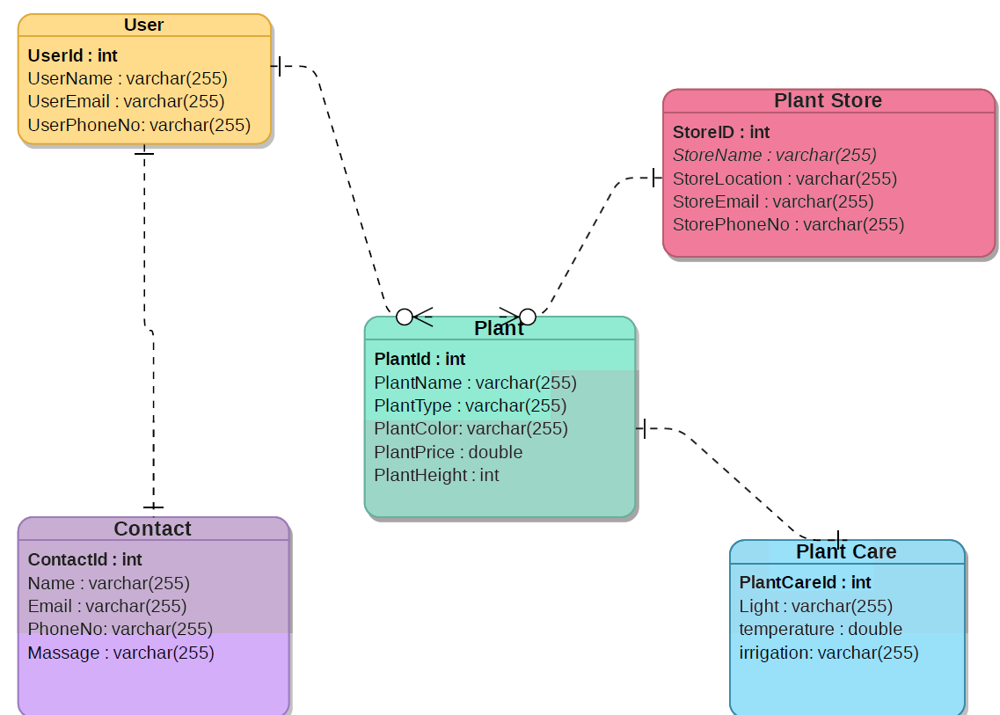
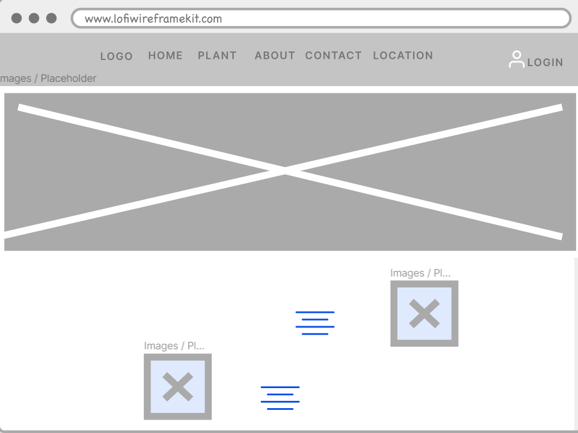
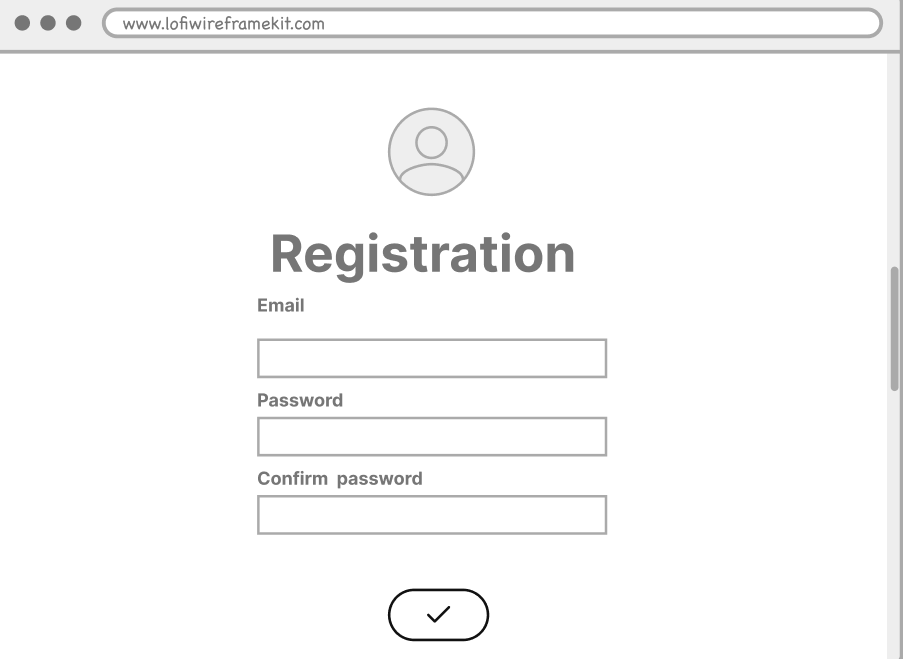
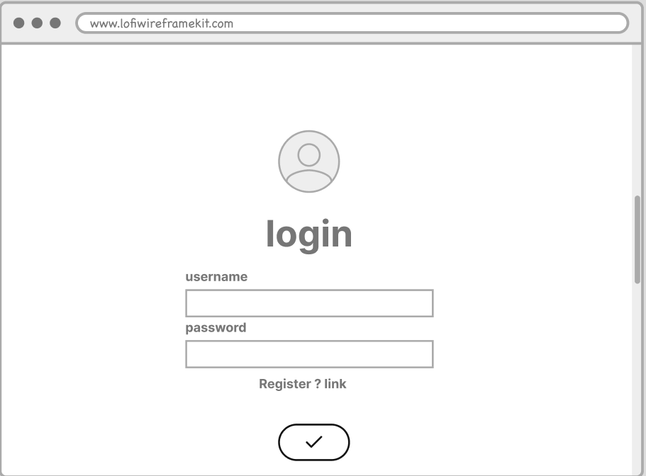
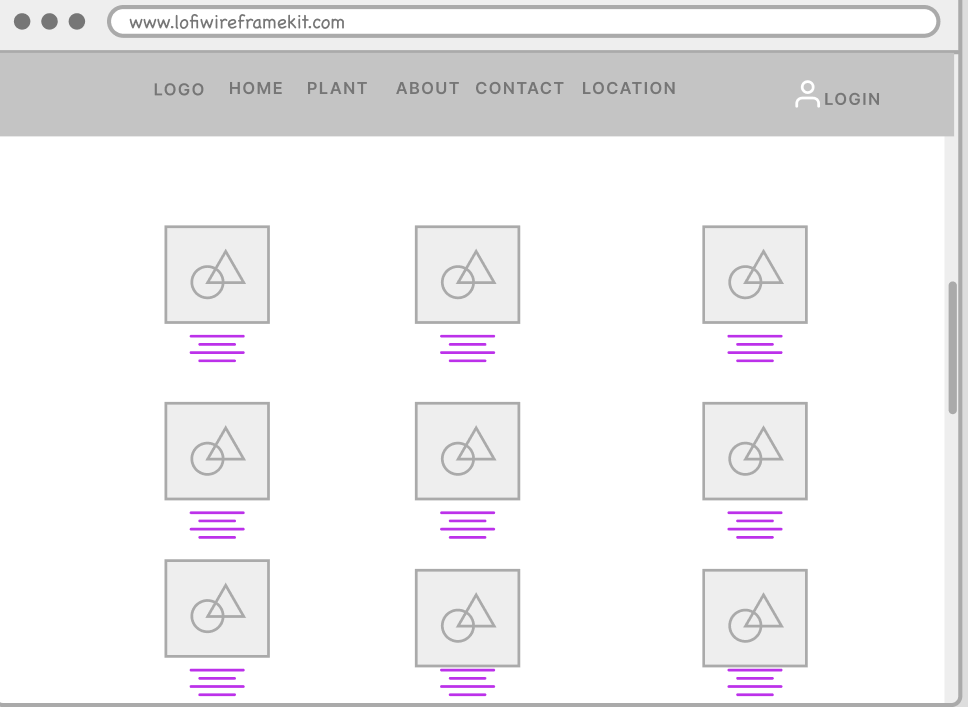
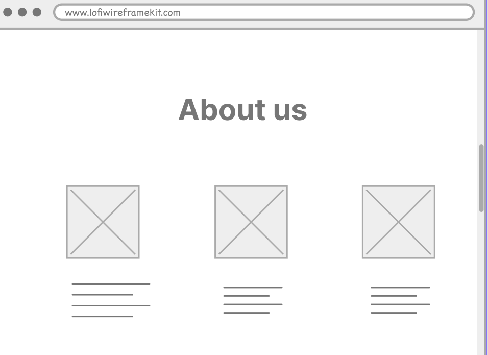
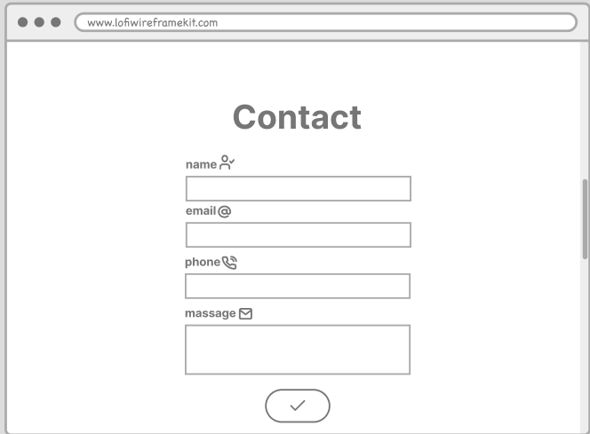
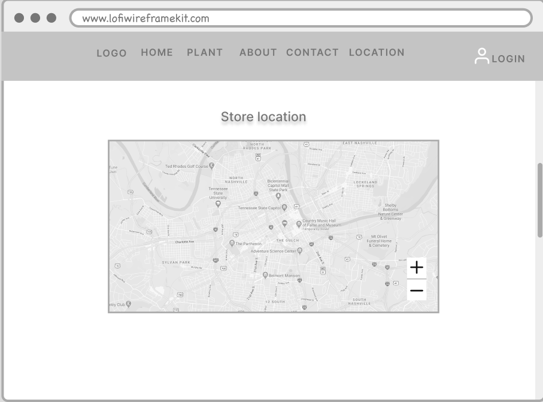

# Plant Store

## Idea of project :
 Plant store where it displays a range of plant species, and CRUD operations can be applied either by deleting, modifying, or displaying the details of the plant, As for the Create opertation, it was applied throug e-mail as it creates a new message and is saved in the database. 


### ERD
 > ERD 


### Demo  
 


https://user-images.githubusercontent.com/82478321/122554323-7fc4fd00-d041-11eb-9b99-c3dc5c5f34b8.mp4


### Wireframe  

 <div dir="ltr" align="center">


> Home page 

>Registration page 

>login page 

>Plant page

>About page

>Contact page 

>Location page


  </div>

### Set up  
### Prerequisites
- NET 5 
- ASP.NET MVC
- Microsoft SQL Server 
### Set up  
 #### Database
 ``` dotnet ef database update```
### Front-End  
 - HTML
 - CSS
 - JS
 - Bootstrap 
### Back-End 
 - ASP.NET MVC
 - MSSQL Server
 - EF Core
 - Google Map API

### Author
Taif Bin Eid
</div>
